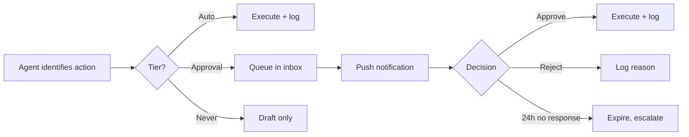

# mcsecocleaning — PRD v2.1

**Date:** 18 September 2026
**Supersedes:** v2.0 (September 2026)
**Market:** United Kingdom
**Currency:** GBP

Merges the AI agent architecture, current market pricing, DMCC review law and the paid acquisition plan into the v2.0 build specification.

---

## 1. Changelog from v2.0

v2.0 remains the structural spine. v2.1 adds the agent architecture, current market data, and the launch decisions that v2.0 left open.

### Added

| Change | Where | Why |
| --- | --- | --- |
| Agent action tiers and approval flow | §11 | v2.0 deferred AI entirely; the approval-gated copilot is a stated product requirement |
| September 2026 London market rates | §5 | v2.0 specified pricing structure but carried no current figures |
| DMCC 2024 fake review law | §10, §14 | Post-dates v2.0. Banned practice, direct CMA fines to 10% of global turnover |
| Launch footprint decided | §4 | Answers v2.0 open decision #1 |
| Paid acquisition budget and LSA detail | §16 | v2.0 named the channel but gave no numbers |
| Realistic SEO timeline | §6 | Sets expectation against "rank for cleaning across London" |

### Rules for the build agent, carried forward unchanged from v2.0

1. Build phases sequentially. Each phase meets its acceptance criteria before the next begins.
2. Do not skip Phase 0. It contains external processes with multi-week lead times.
3. MUST is a hard requirement, usually legal or architectural. SHOULD means use judgement and flag deviations.
4. UK English throughout, in code and copy. See §6.
5. Ship Phase 1 to production immediately. The SEO clock starts on indexing.

### Conflicts resolved

The standalone London agency PRD and v2.0 disagreed in two places. v2.0 wins both.

- **Payment capture.** The standalone doc proposed saving a card and charging after the job. v2.0 specifies `PaymentIntent` with `capture_method: manual` — authorise at booking, capture on completion. v2.0 is correct: final price changes on site, and manual capture makes the Consumer Contracts position cleaner. See §8.
- **Pricing inputs.** The standalone doc used a bedroom-count lookup table. v2.0 prices on room composition weighted by kitchens and bathrooms. v2.0 is correct — a two-bed with one bathroom and a two-bed with three are different jobs. See §5.

**Scope question still open.** v2.0 describes an eco-positioned business with six verticals including commercial and communal. The launch plan in §4 is domestic-first in South London. These are compatible — domestic is the wedge, commercial follows — but the eco pillar (§6) needs a decision on whether it is the primary positioning from day one or a phase two differentiator. Flagged in §16.

---

## 2. Executive summary

A full-stack web application for a UK eco-friendly cleaning company that operates its own crews, not a marketplace. The system is four things at once: a marketing site engineered for local search, a booking and payments platform, an operations system, and a customer portal.

**Business model.** The company employs or contracts its own crews and fulfils all work directly. Revenue comes from one-off jobs — primarily end of tenancy and deep cleans — and recurring contracts across domestic, commercial office, and communal area cleaning for residential blocks.

**Positioning.** Eco-friendly cleaning with transparent published pricing, photographic proof of work, and a stated re-clean guarantee. Most UK cleaning companies still require a phone call for a quote and provide no evidence of work completed. That is the gap.

**The commercial insight driving build order.** End of tenancy is high-ticket, urgent, high-intent and seasonal. It generates cash and reviews quickly, and it produces letting-agent relationships that open the door to recurring commercial work. Domestic recurring builds the stable base underneath it.

**What the AI layer does and does not do.** The agent drafts, monitors and recommends. A human authorises anything that spends money, contacts customers at scale, or changes a price. This is a deliberate constraint, specified in §11, not a limitation to be engineered away later. The realistic value of AI here is removing the production bottleneck — twenty ad variants instead of three, follow-up that never gets forgotten, reporting without a spreadsheet. It does not remove the need for someone to decide what the business says and what it spends.

**Sequencing principle.** The software is the tractable part. The hard part is the first ten paying customers and the first ten genuine reviews, and no amount of engineering shortens that. Every phase in §16 should leave the business better off if you stop there.

---

## 3. Goals, non-goals and roles

### Goals

1. Rank in the Google map pack and local organic results for target service × area terms within 6 months of the core cluster.
2. Allow customers to get an instant, accurate, fixed price online and book without phoning.
3. Convert one-off customers into recurring contracts.
4. Run daily operations — scheduling, crew dispatch, quality control, payroll — from one system.
5. Provide photographic evidence of every completed job, as both a trust feature and dispute protection.
6. Resolve complaints fast through a guaranteed re-clean, and capture the outcome.
7. Comply with UK VAT, consumer, review and data protection law from day one rather than retrofitting.

### Non-goals for v2.1

- Marketplace of independent third-party contractors
- Native mobile apps (responsive web only; crew interface must work well on a phone browser)
- Multi-currency or non-UK operation
- Public-sector tendering workflow — requires accreditations out of reach in year one
- Full route optimisation (travel-time buffering only)
- Self-hosted LLM
- Autonomous agent execution of spend, pricing or customer-facing decisions (§11)

### Roles

| Role | Description |
| --- | --- |
| Customer | Books jobs, manages properties and subscriptions, uploads media, views completed-job photos, raises issues, leaves reviews |
| Crew | Views assigned jobs, sees access instructions, clocks in and out, completes checklists, uploads before/after media, updates status |
| Supervisor | Crew permissions, plus all jobs for their team, reassignment within team, checklist review |
| Admin/Ops | Full operational access: jobs, scheduling, crews, clients, payments, media, complaints, payroll, reports, agent approval inbox |
| Owner | Admin plus pricing configuration, VAT settings, staff pay rates, financial reports, agent configuration |

**Requirements**

- Role-based access control MUST be enforced server-side on every route and every data query. Hiding UI elements is not access control.
- Crew MUST NOT see customer payment details, other crews' pay rates, or jobs not assigned to them.
- Property access codes are restricted — see §9.
- The agent operates under a service identity with its own permission set, and MUST NOT hold permissions exceeding the Admin role. Every agent action is attributed to that identity in the audit log.

---

## 4. Launch footprint and service area

Launch in South London. Expand west once the review base exists. This answers v2.0's first open decision.

Local search is decided substantially by proximity between the searcher and the registered business address. Targeting all of London means ranking in none of it, and a business based south of the river will not surface for West London searches regardless of site quality. Being genuinely local to the launch cluster is the single largest ranking advantage available.

### Phase one — core cluster

| District | Area | Notes |
| --- | --- | --- |
| SE11 | Kennington | Core |
| SE1 | Elephant & Castle | Core, high flat density |
| SW2 / SW9 | Brixton | Core |
| SW4 | Clapham | Strong professional household density |
| SW11 | Battersea | Adjacent, new build stock |
| SW18 | Wandsworth | Strong recurring domestic market |
| SE15 | Peckham | Core |

Contiguous, all reachable without a crew losing an hour in traffic, and materially less agency saturation than West London.

**Phase one B — Bromley (BR1).** Worth serving, but a long way from the Kennington–Clapham cluster. It MUST be a separate patch with its own crew and its own round. Never share a crew between Bromley and the core cluster — the travel model in §7 will not absorb it.

**Phase two — West London.** Chelsea, Fulham, Hammersmith first; then Kensington, Notting Hill, Holland Park, Chiswick, Barnes, Putney. Knightsbridge, Belgravia and Mayfair last: highest value, most competitive, and clients there typically want a vetted, insured, long-established firm with references.

**Expansion trigger.** Roughly 25–30 genuine reviews and reliable crew supply in the core cluster — not a calendar date. Ranking in a new borough requires proximity signals there: real customers, real reviews from those postcodes, ideally a service address.

**Service area enforcement.** Postcode districts, not a radius. Districts are what customers type and what you can staff. Validated at booking step 0 (§7). Out-of-area postcodes go to waitlist capture — those addresses are the data that tells you where to expand next.

**London operating costs.** ULEZ and Congestion Charge are real per-job costs and SHOULD be configurable inputs to commercial pricing. Parking and permit conditions vary sharply across these districts and are captured per property (§9).

---

## 5. Service verticals and pricing

The quote engine MUST output both a price and an estimated duration. Duration feeds the capacity system in §7 — they are the same calculation.

### Verticals

| Vertical | Model | Notes |
| --- | --- | --- |
| Domestic cleaning | Recurring weekly / fortnightly / monthly, or one-off | Core recurring revenue base |
| End of tenancy | One-off, fixed price | Highest ticket and intent. 72-hour re-clean guarantee |
| Deep cleaning | One-off, fixed price | Often the entry point that converts to recurring |
| After builders | One-off, quoted | Higher rate, specialist equipment |
| Office / commercial | Recurring contract | RFQ, not self-serve checkout |
| Communal areas | Recurring contract | Managing agents / RTM. Billing entity differs from site contact |

### Room-based pricing

Do NOT price on bedroom count alone or square footage. A two-bed with one bathroom and a two-bed with three bathrooms are different jobs.

Inputs: kitchens (highest per-room cost and time), bathrooms and WCs (second highest), reception rooms, bedrooms, then lower-cost increments for hallways, studies and conservatories. Plus property condition (standard / heavily soiled multiplier) and service level (regular / deep / end of tenancy multiplier).

### Market rates as of September 2026

v2.0 specified the structure but carried no figures. These are current and should calibrate the rate card.

| Segment | Rate |
| --- | --- |
| London agency, regular domestic | £20–£25/hr |
| London vetted independent | £13–£18/hr |
| Agency premium over independent | £4–£10/hr |
| London deep clean | £25–£45/hr |
| End of tenancy, 1-bed house (published example) | ~£287 |
| End of tenancy, 5-bed house (published example) | ~£621 |
| Oven interior add-on | £55–£85 |

The agency premium covers DBS checks, insurance, management, cover arrangements and vetting. Do not compete at the bottom of the range — undercutting independents means competing with operators carrying no insurance and no overhead, and it leaves nothing to pay a reliable crew with. Eco positioning (§6) supports a premium point; eco-conscious buyers are less price-sensitive, which protects margin from the race to the bottom that kills most cleaning startups.

**Indicative rate card** (calibrate against the cost-per-crew-hour model in §16 Phase 0 before publishing):

| Service | Rate | Minimum |
| --- | --- | --- |
| Regular, weekly | £22/hr | 2 hrs |
| Regular, fortnightly | £23/hr | 2.5 hrs |
| One-off | £26/hr | 3 hrs |
| Deep clean | £30/hr | 4 hrs |
| End of tenancy | Fixed grid by property | — |

### Required pricing mechanics

- **Minimum job value**, configurable. Market norm around £120 for end of tenancy.
- **First-clean surcharge** for new recurring customers. A first visit takes 1.5–2× a maintenance visit. Not pricing this loses money on every new client. MUST be configurable and applied automatically to the first job of a new subscription.
- **Frequency discount.** Weekly and fortnightly plans commonly carry up to 25% off standard rates. This is the primary conversion-to-recurring mechanism and MUST be visible in the quote as an explicit saving. It is the highest-leverage piece of copy on the site.
- **Regional multiplier**, configurable, for the phase two expansion.
- **Add-ons** each carrying their own price and duration: interior windows, oven and appliance interiors priced per appliance, carpet cleaning per area, upholstery, fridge/freezer interior, balcony.
- **Hourly mode** SHOULD be supported as an alternative to fixed pricing for regular domestic, configurable per service type, since a meaningful share of the UK market prices this way.

**Commercial** is priced per square foot or per visit-hour and quoted manually via the RFQ flow. No self-serve checkout.

### Published pricing

The site MUST publish "from" prices for all self-serve services. This is a deliberate differentiator and directly captures "how much does X cost" search intent. Prices displayed to consumers MUST be VAT-inclusive (§14), and the total including all mandatory charges MUST be shown on the quote screen — drip pricing is a prohibited practice under the same Act covering fake reviews.

### Duration estimates

The hour estimates are the most commercially important numbers in the system and the most likely to be wrong at launch. Track actual against estimated duration on every job from day one (§9 clock-in/out) and correct the rate card monthly for the first quarter. Underestimating by thirty minutes on a fortnightly clean destroys the margin on that customer for years.

### Competitor benchmark — tenancy.cleaning

A nationwide UK operator publishing a full fixed-price grid. Useful as a structural model, with two caveats below.

| Property | End of tenancy / deep / after builders |
| --- | --- |
| Studio flat (incl. appliances) | £135 |
| 1 bed, 1 bath | £175 |
| 2 bed, 1 bath | £230 |
| 2 bed, 2 bath | £270 |
| 3 bed, 1 bath | £325 |
| 3 bed, 2 bath | £360 |
| 4 bed, 1 bath | £390 |
| 4 bed, 2 bath | £435 |
| 5 bed+ | From £475 |

**This grid confirms the §5 pricing rule.** Same bedroom count, different bathroom count, £40 apart at two beds and £35 at three. An operator at their volume has priced the bathroom differential deliberately. Build the end of tenancy grid on bedroom × bathroom, exactly as specified above.

**Add-on menu, priced per unit rather than bundled:**

| Category | Items |
| --- | --- |
| Carpet & rugs | Per area £30 · per rug £25 · hallway £15 · stairs per flight £25 |
| Upholstery | 1-seat £35 · 2-seat £55 · 3-seat £60 · L-shape £95 · mattress £25 · curtains (pair) £35 |
| Appliances | Single oven £35 · double oven £45 · range cooker £60 · fridge freezer £40 · washing machine £30 · dishwasher £30 |
| Pressure washing | £3.50 per m² |

The granularity is the lesson. "Hallway £15" and "stairs per flight £25" are separately bookable lines, not judgement calls at the door. Each one is a small upsell that needs no negotiation. Mirror this structure in the `AddOn` records.

**Two caveats before copying the numbers.**

First, **these are nationwide averages, not London prices.** London commands 25–40% above the UK norm (§5 market rates), and their grid sits below the London published figures cited above — roughly £287 for a one-bed house. Use their *structure*, not their *rates*. Pricing a London end of tenancy at £175 for a one-bed would put you under the market and under your own cost floor.

Second, **their homepage and price page disagree.** The homepage lists a double oven clean "From £55"; the prices page lists £45. That inconsistency is exactly the drip-pricing and misleading-price exposure covered in §14.3. One rate card, one source of truth, rendered everywhere from the same data. This is an argument for the versioned rate card in §7.2, not just a tidiness point.

**A note on their model.** They advertise 200+ teams nationwide and run a "Join as a Provider" page — this is a subcontractor network, not directly employed crews. It explains the 4.3 average rating: quality varies across a network you do not directly control. Own crews in a tight cluster is the harder model to scale and the easier model to keep at 4.8+. That consistency is a differentiator worth naming on the site.

Source: [tenancy.cleaning price list](https://tenancy.cleaning/prices/)

**Sources:** [St Anne's London price index](https://stanneshousekeeping.com/blog/london-cleaning-price-index-2026) · [FeelClean 2026 guide](https://feelclean.co.uk/domestic-cleaner-cost-per-hour-london-2026/) · [CityHousekeeping published prices](https://cityhousekeeping.co.uk/how-much-does-a-cleaner-cost-london-2026/) · [Urban Shine cost guide](https://urbanshinecleaners.co.uk/house-cleaning-cost-in-london-2026/)

---

## 6. SEO and content strategy

SEO is a product requirement, not a marketing afterthought. It shapes the URL structure, the rendering strategy and the content model.

### Setting the expectation first

Ranking for "cleaning" across London is not achievable and no technical implementation makes it achievable. Local cleaning is among the most competitive UK local categories, the top positions belong to firms with thousands of reviews and years of history, and the map pack is weighted heavily by searcher-to-business distance. What is achievable: ranking well within a few miles of base, within six to twelve months, with enough reviews.

| Month | Expectation |
| --- | --- |
| 1–2 | GBP verified, pages live, 10 seeded reviews. No organic traffic |
| 3–4 | Long-tail terms: "cleaner SE11", "end of tenancy Clapham" |
| 5–8 | Map pack for some core terms within a mile or two of base |
| 9–12 | Consistent map pack presence across the core cluster |

This is why paid comes first (§16). Something has to fill the schedule in months 1–3.

### Technical baseline

- **Next.js with SSR/SSG** for all public pages. Marketing and service pages MUST be server-rendered and fully crawlable.
- **Core Web Vitals targets:** LCP < 2.5s, INP < 200ms, CLS < 0.1 on mobile. These are the thresholds, not a generic load-time goal.
- All images via `next/image`, AVIF/WebP, explicit dimensions, lazy-loaded below the fold. Before/after galleries will destroy LCP if unmanaged.
- Clean semantic URLs, auto-generated XML sitemap, robots.txt, canonical tags.
- `noindex` all authenticated routes, booking wizard steps and the customer dashboard.
- SSL, GA4 behind cookie consent (§14), Google Search Console.
- `llms.txt` at root — AI assistants are a growing local discovery channel.
- Review widgets MUST render so a slow third-party script cannot block the booking flow.

### Structured data

| Schema | Where |
| --- | --- |
| `LocalBusiness` (+ `CleaningService`) | Site-wide, NAP matching GBP exactly |
| `Service` | Each service page |
| `FAQPage` | Each service and location page |
| `BreadcrumbList` | All pages |
| `Organization` | Site-wide |

**Be conservative with `AggregateRating`.** Google restricts self-serving review markup — marking up reviews you collected about your own business can trigger a manual action. Display reviews for users; do not mark them up as `AggregateRating` on `LocalBusiness`.

### Location pages — content gate is mandatory

Service × area pages generated from a template are the exact pattern Google names as doorway abuse, adjacent to scaled content abuse. Templated near-duplicate location pages have seen heavy demotions. The line is crossed when a location page is only a keyword container.

**Enforce this in the CMS as a publishing gate, not as guidance.** A location page MUST NOT publish unless it has:

- ≥ 400 words of genuinely area-specific content
- ≥ 1 photograph taken in that area
- ≥ 1 customer review from that area
- Area-specific pricing or service notes

Genuinely local content means property stock (period conversions vs new builds), HMO and student-let density, parking and permit conditions, named streets and landmarks, area-specific pricing.

**Launch with the seven core districts in §4.** Add pages only as real coverage expands. Target boroughs, towns and postcode districts — not cities. Nobody searches "cleaner London" with intent to book.

### URL structure

```
/                                       Home
/domestic-cleaning                      Service hub
/domestic-cleaning/[area]               Location page (content-gated)
/end-of-tenancy-cleaning
/end-of-tenancy-cleaning/[area]
/deep-cleaning
/after-builders-cleaning
/office-cleaning
/office-cleaning/[area]
/communal-area-cleaning
/eco-cleaning                           Positioning pillar
/prices                                 Published price list
/areas-we-cover                         Hub linking all location pages
/about  /contact  /reviews  /guarantee
/blog/[slug]                            Content hub
/book                                   Booking wizard (noindex)
/account/*                              Customer dashboard (noindex)
/admin/*  /crew/*                       Internal (noindex)
```

### UK terminology — required

American terminology will fail to rank. Use throughout code, copy and URLs:

| Do not use | Use |
| --- | --- |
| Residential cleaning | Domestic cleaning |
| Move-out cleaning | End of tenancy cleaning |
| Public space cleaning | Communal area cleaning |
| Maid service | Cleaner / cleaning service |
| Post-construction | After builders cleaning |
| Sq ft (domestic) | Rooms / bedrooms / bathrooms |
| ZIP code | Postcode |

### Eco positioning

The brand is mcs**eco**cleaning. This is a differentiator and a distinct, lower-competition keyword cluster, and it MUST be built into the product rather than treated as a tagline.

- **Keyword pillar:** eco friendly cleaning [area], green cleaning service, non-toxic cleaning, chemical-free cleaning, pet safe cleaning products, allergy-friendly cleaning
- **Product transparency page** — the actual products used, their certifications, what is not used and why
- **Booking wizard option** for fragrance-free, allergy-sensitive or pet-safe product sets, stored as a property preference and surfaced to crew
- **Commercial relevance:** UK commercial cleaning tenders increasingly carry ESG requirements. Documented green practice wins contracts competitors cannot bid for.

### Content hub

Publishing MUST begin in Phase 1. Launch set: how much does a cleaner cost in [area]; end of tenancy checklist (downloadable, also a lead magnet); deep clean vs regular clean; how often should an office be cleaned; what's actually in conventional cleaning products; pet-safe and allergy-friendly cleaning; getting your deposit back.

Blog content is a distant second to GBP and location pages for local services. Do not let it displace them.

**Content accuracy requirement.** Since the Tenant Fees Act 2019, landlords in England cannot require tenants to pay for professional cleaning as a blanket tenancy condition. Tenants must still return the property in its original condition, fair wear and tear excepted. Do not publish copy claiming professional cleaning is legally required — it is inaccurate under the CPRs and a poor E-E-A-T signal. Frame around deposit protection.

### Google Business Profile — parallel workstream

GBP is the primary lead source and outranks everything else you can do. Map pack ranking is driven by proximity, profile completeness and activity, review volume, quality and recency, and NAP consistency. This starts in Phase 0, before any code, because verification has lead time and reviews accumulate slowly.

- Verification started immediately
- Primary category: House Cleaning Service. Secondaries: Commercial Cleaning Service, Office Cleaning Service, Carpet Cleaning Service, Window Cleaning Service
- Complete service list with descriptions and pricing
- Service area matching actual coverage
- New photos weekly; GBP posts weekly
- Q&A seeded and maintained
- Every review answered within 24 hours
- Booking link → booking wizard
- NAP identical to site footer, character for character, and across Companies House and every directory

---

## 7. Booking, quoting and scheduling

### 7.1 Booking wizard

Multi-step, mobile-first, progress indication, running price visible at every step. Full flow completable on a phone in under two minutes.

| Step | Content |
| --- | --- |
| 0 | Service area check. Postcode validated before anything else. Out-of-area → waitlist capture |
| 1 | Service selection. Commercial routes to RFQ |
| 2 | Property. Room counts (§5), condition, type. Saved properties pre-fill |
| 3 | Frequency. Discount shown as an explicit saving |
| 4 | Add-ons, each showing price and added duration |
| 5 | Date and time, from real capacity |
| 6 | Access and preferences. Entry method, parking, pets, product preferences |
| 7 | Details and payment, plus the CCR consent checkbox (§14) |

The quote MUST appear before contact details are requested. Asking for an email before showing a price is the most common conversion killer on cleaning sites.

**Requirements.** Progress MUST persist — abandoned bookings recoverable via email. The quote MUST be stored with a version reference so the price honoured is the price quoted. Never offer a slot that cannot be staffed.

**No account required to book.** Offer one after the first job, when there is a reason to have it. Magic-link guest checkout otherwise.

### 7.2 Quote engine

**A deterministic rules engine, not a model.** Prices MUST be reproducible, auditable and identical for two customers with the same inputs. A model that quotes £180 on Tuesday and £240 on Wednesday for the same flat creates disputes you cannot win and margins you cannot forecast. This is the single hardest constraint to hold when everything else is AI-powered — hold it.

Inputs per §5, output price and estimated duration. Store every quote with inputs, calculated price, rate card version and a 14-day expiry.

**Escalation.** Five bedrooms or more, end of tenancy, commercial, and anything flagged heavily soiled bypass instant pricing and route to callback or RFQ. Roughly one booking in ten should escalate; more than that means the rules are too narrow.

### 7.3 Scheduling engine — critical architecture

> **v1.0 generated recurring jobs from Stripe billing webhooks. That approach is broken and MUST NOT be implemented.**

Billing cycles are not cleaning visits. A weekly client billed monthly is 4–5 visits per invoice, not one. Jobs must exist on the calendar weeks ahead so crews can be assigned and capacity planned. A failed card payment would silently delete a scheduled clean. And a recurring client asking to move one visit has no job record to move.

**Required design — schedule and billing fully decoupled:**

```
Subscription
  ├── recurrence_rule (RRULE, e.g. FREQ=WEEKLY;BYDAY=TU)
  ├── stripe_subscription_id      ← billing only
  └── generates ↓

Job records, materialised 8–12 weeks forward by a rolling scheduled task
  ├── scheduled_date              ← individually editable
  ├── payment_status              ← independent of the job's existence
  └── subscription_id (nullable)
```

**Rules**

- A scheduled task runs daily, materialising Job records from each active subscription's recurrence rule up to a rolling 8–12 week horizon.
- Stripe billing runs on its own cadence and only sets `payment_status`. It never creates or deletes jobs.
- Individual visits can be skipped, moved or cancelled without touching the subscription.
- A failed payment raises an admin flag and a customer notification. It does not remove the job from the schedule.
- Use `rrule.js`. Do NOT hand-roll recurrence logic — bank holidays, month-ends and BST/GMT transitions will break it.
- Blackout dates MUST shift or flag affected jobs rather than silently generating them.

**Customer-facing skip.** Recurring customers MUST have a one-tap way to skip a single visit. Customers who cannot easily skip a week cancel the whole arrangement instead.

### 7.4 Capacity and availability

You cannot offer a slot you cannot staff. A `SlotAvailability` service computes bookable slots from: estimated job duration from the quote engine, crew roster, crew time off, existing bookings, travel time, and a configurable buffer.

Admin MUST be able to override capacity manually and to set a simple daily cap as a fallback in early operation when the roster is small.

### 7.5 Travel time

Travel between consecutive jobs feeds capacity. Naive distance-based buffering is acceptable; full route optimisation is out of scope.

Minimum buffers: 45 minutes for cross-district moves, 30 minutes within a district. A crew finishing in Clapham at 12:00 cannot start in Peckham at 12:30. This is also the arithmetic reason Bromley is a separate patch (§4).

### 7.6 Commercial RFQ

Office and communal clients MUST NOT go through the self-serve wizard — these contracts involve site visits, custom scope, insurance requirements and negotiation.

```
"Request a commercial quote" form
  → Lead record created
  → Admin arranges site survey
  → Admin builds proposal (scope, frequency, price, term)
  → Sent to client, viewable and acceptable online
  → Acceptance → Subscription + recurring Job generation
```

Capture: site type, approximate square footage, frequency, floor types, access hours, number of WCs, waste requirements, insurance and accreditation requirements, decision timeline.

**Communal specifics.** The billing entity (managing agent) differs from the site contact and from the residents. The data model MUST support a billing organisation separate from the site and its contacts.

**Consultation booking.** Use Cal.com for the site survey and commercial consultation slots only. It books meetings between people; it does not schedule jobs across a geography, and the two must not be conflated. Attach Google Meet rather than Teams — the counterparty often has no Microsoft account.

---

## 8. Payments

**Model: authorise at booking, capture on completion.** Use Stripe `PaymentIntent` with `capture_method: manual`, or a `SetupIntent` to save the card and charge off-session at completion.

Do NOT use default Stripe Checkout immediate capture. The final price changes — extra rooms found on site, add-ons requested, cancellation or lockout fees — and capture-on-completion also makes the Consumer Contracts position cleaner (§14).

This also resolves the conflict noted in §1: authorising rather than merely saving the card commits the customer without taking money for work not yet done, which protects conversion while keeping the price adjustable.

| Client type | Method |
| --- | --- |
| Domestic one-off | Card — authorise at booking, capture on completion |
| Domestic recurring | Card on file, charged off-session per visit |
| Deep clean | Authorise full, or 25% deposit captured at booking on large jobs |
| End of tenancy | 25% deposit captured, balance on completion |
| Commercial recurring | Bacs Direct Debit or invoice / net-30 |
| Commercial ad-hoc | Invoice, bank transfer |

**Why deposits only on the large jobs.** A no-show on a fortnightly two-hour clean costs two hours. A no-show on a full-day end of tenancy costs a day you cannot resell at short notice. The deposit is insurance proportional to the risk.

**Charge per visit, not as a subscription, for recurring cleans.** Cleans get skipped for holidays, and a subscription that bills through a skipped week generates refund work. Stripe Subscriptions handle the billing relationship; the per-visit charge is driven from the Job record (§7.3).

**Bacs Direct Debit** is required for commercial recurring. UK card fees apply to every collection; Bacs is roughly 1% capped at £2 with no card-expiry failures. On a £400/month communal contract this is a meaningful saving and much less failed-payment admin. Available via Stripe or GoCardless. Note the mandate setup period and multi-day collection cycle affect cash flow.

**Bank transfer** is for commercial invoices only. For domestic, manual reconciliation of small transfers costs more time than the revenue is worth. If a domestic customer insists, handle it as an admin exception, not a checkout option.

### Required mechanics

- **Cancellation fee**, enforced, tiered by notice period. Free over 24 hours; 50% inside 24 hours; 100% for no-show or no access. A stated policy with nothing enforcing it is not a policy, and crews quit over unpaid wasted journeys. MUST be fair under the Consumer Rights Act 2015 and disclosed before payment.
- **Lockout / no-access fee** — crew arrives, cannot get in. Common and currently unbilled in most small operations. Triggered from the `no_access` job status (§9).
- **Tipping** — prompt in the post-job email. Meaningful revenue for crews and a retention lever for staff.
- **Refunds** with reason codes, linked to the job.
- **Webhook idempotency** — Stripe *will* deliver duplicates. Store `event.id` and reject replays. Unhandled, this double-charges customers and double-creates jobs.
- **Failed payment queue** in the admin. Roughly 3–5% of saved cards fail on the day. This needs a visible queue, not an email.

**Fees.** Budget roughly 1.5% plus 20p per domestic card transaction. On a £55 clean that is about £1.03, already inside the margin assumption in §5.

**Disputes.** Cleaning attracts "not to standard" chargebacks. The defence is the completion record: timestamped clock-in and clock-out plus before/after media (§9). Chargeback windows run 60–120+ days, which is why media retention is 12–24 months and not 48 hours.

---

## 9. Operations

### 9.1 Job status pipeline

| Status | Meaning | Trigger |
| --- | --- | --- |
| `draft` | Quote created, not confirmed | Wizard in progress |
| `booked` | Confirmed by customer | Booking submitted |
| `payment_authorised` | Card authorised / DD mandate active | Stripe webhook |
| `scheduled` | Crew assigned | Admin or auto-assign |
| `in_progress` | Crew on site | Crew clock-in |
| `completed` | Work finished | Crew marks complete |
| `awaiting_feedback` | Remedy window open | Auto on completion |
| `closed` | Window elapsed or issue resolved | Auto or manual |
| `cancelled` | Cancelled | Manual; fee and refund logic |
| `on_hold` | Paused | Manual |
| `no_access` | Crew attended, could not enter | Crew action; triggers lockout fee |

Every status change MUST be logged with actor, timestamp and optional note. The pipeline drives all downstream automation, including everything the agent monitors in §11.

### 9.2 Crew mobile interface

Design for a phone, often on mobile data, sometimes on a shared device. Consider PIN login on a persistent session rather than repeated password entry.

- **Today's jobs** — list and map, ordered by schedule
- **Job detail** — property, access instructions, parking, pets, product preferences, customer notes, checklist
- **Clock in / clock out** with timestamp and GPS stamp. Drives payroll, proves attendance in disputes, and gives actual-vs-estimated duration — your only real measure of job profitability and the feedback loop that corrects §5
- **Checklist completion** — tick items, attach photos to items
- **Before/after photo capture** — direct upload to storage
- **Status updates** — one tap
- **Report an issue** — damage, access problem, additional work needed

### 9.3 Properties, access and site notes

The `Property` record is operationally critical.

| Field | Notes |
| --- | --- |
| Address, postcode, property type | |
| Room counts | Feeds pricing |
| Entry method | Key held / lockbox / client present / concierge / key safe |
| Lockbox or key safe code | Encrypted at rest |
| Alarm code and instructions | Encrypted at rest |
| Parking instructions | Permits, restrictions, nearest options |
| Pets | Name, type, temperament, containment |
| Do-not-touch areas | |
| Product preferences / allergies | Links to eco options (§6) |
| Access notes | Free text |
| Preferred crew | Significant retention factor in domestic work |

**Security requirement.** Access codes MUST be encrypted at rest and visible only to the assigned crew, and only within a configurable window around the scheduled job (e.g. 2 hours before to 2 hours after). Access to codes MUST be logged. Codes MUST NOT appear in any email or SMS body. Treat these with the same seriousness as payment data — a leaked alarm code is a burglary.

**Key holding.** If keys are held physically, they MUST be labelled without addresses, logged in and out, and covered by the insurance in §14. Key loss is a common and expensive claim.

### 9.4 Media exchange

**Customer → business (pre-job).** Upload widget visible only while the job is active (`booked` through `in_progress`), hidden once completed. Backend issues a short-lived (5–15 min) presigned PUT URL scoped to the job ID; browser uploads direct to object storage; backend records the file reference.

**Business → customer (completed work).** Crew uploads before/after photos. Customer receives a stable link containing a JWT with the job ID and a 48-hour expiry. On click, the backend validates expiry server-side, generates a fresh short-lived presigned GET URL and redirects. After expiry the customer sees an "expired — contact us" message.

> **The link expires, the media does not.** Before/after photos are your primary evidence in damage disputes and card chargebacks, and chargeback windows run 60–120+ days. Deleting evidence at 48 hours to save storage on R2 — where egress is free and storage costs pennies — is a bad trade.
>
> **Required: media retained 12–24 months, admin-accessible throughout. Only the customer-facing link expires.**

### 9.5 Issue resolution and re-clean guarantee

> **The window is a guaranteed-remedy window, not a support cut-off.** You cannot refuse to hear a customer after 48 hours, and UK consumer protection will not respect that window.

```
Job → completed
  → Remedy window opens automatically
      · 72 hours for end of tenancy (UK market standard)
      · 48 hours for domestic and commercial
  → Customer notified by email + SMS with a link to the thread
  → Customer reports issue (text + optional photos)
  → Admin triages; sentiment/urgency flagged in the dashboard
  → Resolution paths:
       · Re-clean — zero-price Job created, linked to original, scheduled within 24–48h
       · Partial refund
       · Explanation / no action
  → Window elapses → thread converts to a general support ticket
    (customer always retains a route to contact you)
```

**A separate damage/breakage claim path** is required — different handling (insurance notification, evidence gathering, escalation) and different retention requirements from a general complaint.

**Market the guarantee explicitly.** "72-hour re-clean guarantee" on the end of tenancy landing page is a conversion lever, not just a policy.

### 9.6 Quality control checklists

Per-service-type task templates completed on site. This is how quality stays consistent across crews and how you defend against disputes.

- `ServiceTemplate` defines checklist items per service type
- `JobChecklistItem` records completion, by whom, when, with optional photo
- **End of tenancy checklists MUST mirror what inventory clerks assess** — inside cupboards, appliance interiors, limescale, skirting boards, interior windows, extractor fans. This is your evidence in a deposit dispute.
- Admin can require photo evidence on specified items

### 9.7 Admin back office

**Today view is the default screen:** jobs today with status, anything unassigned, anything overdue for check-in, failed payments, and the agent's pending approvals. Nothing else. If checking the day's state takes more than thirty seconds, the business does not fit around anything else.

Beyond that: job board with filters and reassignment; crew roster with DBS and insurance expiry warnings; customer records; quote overrides with a required reason (feeding back into §5); payments queue; and the agent approval inbox (§11).

**Admin-created bookings are required from Phase 2.** In the first 12 months a large share of bookings will arrive by phone, WhatsApp or referral. Admin MUST be able to create a customer, property and job manually, take payment by payment link, or mark as invoice or cash. Without it the business cannot operate on day one. CSV import for any existing client list is also required.

### 9.8 Payroll

- Pay rate per crew member (hourly, per-job, or percentage)
- Hours from clock-in/clock-out records
- Holiday accrual tracking
- Period report: hours worked, jobs completed, pay owed
- Export in a format your accountant or payroll software can consume

---

## 10. Growth systems

### 10.1 Reviews

Review volume and recency directly drive map pack ranking *and* conversion rate. This is the highest-ROI system in the build.

**Every review on the site MUST come from a real job.** Fake reviews are a banned practice under the Digital Markets, Competition and Consumers Act 2024, in force since 6 April 2025. Banned means automatically unfair and illegal — the CMA does not need to prove any consumer was misled. It can fine directly, without going to court, up to 10% of global annual turnover, and order redress. In March 2026 it opened five fake-review investigations across funerals, food delivery and car sales. This is an active enforcement priority.

The prohibition is broader than invented reviews. It also covers incentivised reviews not clearly marked as such, hiding negative reviews, and presenting misleading star ratings. There is a positive duty to take reasonable and proportionate steps to prevent fake reviews appearing in your own marketing. Separately, Google delists businesses caught with fabricated reviews — which would remove the foundation of the entire acquisition plan in §6.

**Cold-start seeding plan.** Below roughly 10 reviews you are invisible in the map pack. Solve this deliberately and legitimately:

1. Do 8–10 free or heavily discounted cleans across the target districts, run through the real booking system.
2. Ask each customer for an honest Google review. Not a scripted one.
3. Because the clean was free or discounted, the review is incentivised and MUST say so. A line such as "I received this clean free in exchange for an honest review" keeps it inside the rules. Unmarked incentivised reviews are themselves a banned practice.
4. Target 10 genuine reviews before spending anything on ads.

This takes two to three weeks and doubles as the best possible system test — real customers, real payments, real edge cases, and it surfaces the duration estimates that are wrong.

**Ongoing engine.**

- Automated request at 24 hours post-completion, email and SMS
- Follow-up nudge at day 4 if no review recorded, then stop
- Deep link direct to the Google review form — reduce to one tap
- Trustpilot as secondary, added once there are 20+ reviews. Below that an empty widget reads worse than none
- On-site display of reviews, with the `AggregateRating` caution in §6
- Target: 5+ new Google reviews per month sustained, 30–40% of completed jobs producing a review
- Track review velocity as a core metric

**Do NOT build a review gate.** Asking for satisfaction first and routing only happy customers to Google violates Google's policy, risks the profile, and sits close to the DMCC prohibition on hiding negative reviews. Everyone gets the public review request. A private feedback route may be offered *in addition*, as a way to reach you directly — never instead.

**Provenance.** The `Review` record MUST store whether the underlying job was free, discounted or full-price, so incentivised reviews can be identified and disclosed. This is a compliance requirement, not a nicety.

### 10.2 Growth mechanics

- **Discount codes** — percentage or fixed, per-service, expiry, usage caps, single-use or multi. Required for every ad campaign and partnership.
- **Referral programme** — give £25 / get £25, unique code per customer, automatic credit application, promoted in every post-job email. Cleaning has exceptionally high referral rates, and a neighbour's recommendation clears the trust barrier that a new cleaning company cannot clear with advertising.
- **Frequency discount** — see §5. The core recurring-conversion mechanism.
- **Account credit** — from referrals, goodwill gestures, partial refunds.
- **Gift vouchers** — SHOULD; sells well in December.
- **Waitlist** for fully-booked slots and out-of-area postcodes.
- **Abandoned quote recovery** — email at 2 hours, again at 48 hours, then stop. People who got a price and did not book have already told you their postcode, property size and intent. Expect 10–15% recovery. This is the highest-ROI automation in the stack.

### 10.3 Notifications

| Trigger | Channel | Recipient |
| --- | --- | --- |
| Booking confirmed | Email + SMS | Customer |
| Pre-contract information | Email (durable medium, §14) | Customer |
| Reminder, 24h before | Email + SMS | Customer |
| Crew on the way | SMS | Customer |
| Job completed + media link | Email + SMS | Customer |
| Review request, 24h after | Email + SMS | Customer |
| Payment failed | Email | Customer + Admin |
| Subscription lapsing | Email | Customer |
| Recurring visit, 3 days before | SMS | Customer (with skip link) |
| New assignment | Push/SMS | Crew |
| Schedule change | SMS | Crew |
| Complaint raised | Email + dashboard | Admin |
| Job stuck in progress | Dashboard alert | Admin |

All customer marketing messages MUST honour PECR consent state and carry a working unsubscribe, including SMS `STOP` (§14). Access codes MUST NOT appear in any notification body (§9.3).

**Cost.** Budget roughly 4p per SMS. At 200 jobs a month with three messages each, about £24 monthly.

---

## 11. AI Copilot and agent architecture

Replaces v2.0 §7. The agent drafts, monitors and recommends. A human authorises anything that spends money, contacts customers at scale, or changes a price.

v2.0 deferred AI almost entirely, on sound reasoning: churn scoring and dynamic pricing on a small dataset produce statistical noise presented with false confidence, which is worse than no analytics because you act on it. That reasoning holds and is preserved in the phasing below. What v2.0 did not specify is the approval-gated copilot, which is a stated product requirement and is buildable now.

The design question is not whether the agent *can* act autonomously. It is which actions must never be autonomous, decided in advance rather than after an incident.

### 11.1 Action tiers

| Tier | Examples | Control |
| --- | --- | --- |
| Auto-execute | Booking confirmations, reminders, review requests, failed-payment flags, daily summary drafts, abandoned-quote emails | Logged, no approval |
| Requires approval | Ad copy going live, budget changes, bulk customer email, refunds over £50, quote overrides, replies to negative reviews, rebooking prompts to lapsing customers | Queued, expires in 24h |
| Never automated | Rate card changes, hiring or removing crew, ending a customer relationship, anything legal or contractual, responses to complaints about crew conduct, anything touching a damage or injury claim | Human only; agent may draft |

The middle tier is where the value sits. The agent doing the drafting and a human doing the deciding removes most of the work without removing the judgement.

### 11.2 Approval flow



The expiry branch matters. An approval queue with no timeout silently becomes a backlog, and the agent stops being useful because nothing it proposes ever happens.

The approval inbox lives inside the admin Today view (§9.7), not in a separate tool. One place to look.

### 11.3 Scope

**Monitors:** unassigned jobs, crew who have not clocked in, failed payments, ad spend against budget, review requests with no response, recurring customers who have skipped twice (a churn signal), jobs stuck in `in_progress`, actual-vs-estimated duration drift.

**Drafts:** ad copy variants, customer emails, review responses, borough landing page copy for human editing, the daily summary, weekly performance reporting.

**Recommends:** which slots to discount to fill, which lapsed customers to contact, when a district has enough demand to justify another crew.

### 11.4 Hard constraints

Write these into the system prompt and enforce them in code where possible:

- **Never quote a price.** Prices come from the deterministic rules engine in §7.2, always.
- **Never promise a slot** not confirmed in the calendar.
- **Never make claims** about DBS status, insurance or guarantees.
- **Never touch access codes.** Property access data (§9.3) is outside the agent's permission scope entirely.
- **Escalate immediately and draft nothing** for any message mentioning damage, theft, injury or legal action. A cheerful automated reply to a message about a broken vase turns a recoverable situation into a complaint.

### 11.5 Provider and data handling

v1.0 specified Kimi K2 (Moonshot AI, China) via OpenRouter. Under UK GDPR, transferring personal data to China requires an International Data Transfer Agreement or the UK Addendum to SCCs, plus a documented Transfer Risk Assessment. There is no UK adequacy decision for China, and routing via OpenRouter adds a second sub-processor and obscures where inference occurs.

**Required: a UK/EU-hosted model** with a signed DPA and zero-retention configuration — Azure OpenAI (UK South), AWS Bedrock (eu-west-2), or equivalent. Given the Copilot Studio route, Azure OpenAI in UK South is the natural fit. Cost difference at this volume is negligible; compliance difference is total.

**Data minimisation, regardless of provider.** Send pseudonymised, aggregated data only — job IDs, dates, service types, numeric metrics. Never names, addresses, phone numbers, access codes, or raw complaint text with PII. Resolve identities client-side after the model responds.

### 11.6 Guardrails and logging

AI drafts; humans approve. Low-stakes actions (internal reminders) may graduate to auto-send after 4–8 weeks of validated accuracy. High-stakes actions never graduate.

Log approve, edit and reject on every suggestion. This is both a trust metric and the signal that tells you which capabilities are ready to move tier.

### 11.7 Phasing

**Do not build the agent first.** It needs real operational data to be useful, and an agent monitoring an empty business generates noise.

| Stage | Capabilities | Precondition |
| --- | --- | --- |
| A | Admin natural-language query over own data (read-only); complaint sentiment and urgency triage; AI-drafted rebooking prompts | Phase 3, post-launch |
| B | Churn risk scoring; pricing suggestions from demand and margin history; crew performance insight; weekly AI business summary | ~500+ completed jobs |

Until stage B, a weekly SQL summary email delivers most of the value for a fraction of the work. Build the monitoring and drafting functions first; add approval-gated actions only once the drafts are trustworthy.

---

## 12. Design requirements

- **Mobile-first.** The majority of local service searches and bookings happen on phones, often outdoors on a patchy connection. Design for a thumb and a 5-inch viewport.
- **Quote widget above the fold** on the homepage — not a phone number.
- **Sticky mobile CTA bar** (call + book) on all public pages.
- **Real photography only.** Actual crews, actual before/afters, actual uniforms and vehicles. Stock imagery measurably reduces conversion for local services. This requires a photo shoot in Phase 0 — it has lead time, and the location page content gate (§6) depends on having area-specific photographs.
- **Trust bar:** insurance (£5m public liability), years trading, aggregate rating, DBS-checked staff, eco credentials, re-clean guarantee.
- **Before/after galleries** per service vertical and per location page, managed against the LCP budget in §6.
- **Distinct visual treatment per service vertical** so users and crawlers parse scope immediately.
- **Clean, high-contrast palette.** Given the eco positioning, greens and natural tones over the generic cleaning-industry blue. Final palette at design phase.
- **Accessibility: WCAG 2.2 AA.** The Equality Act 2010 applies to services, and accessibility quality overlaps heavily with SEO signals.
- Company name, number and registered address in the footer (Companies Act requirement), with NAP character-identical to GBP.
- **Build the booking flow end to end before styling anything.**

### 12.1 Homepage architecture

Revised after reviewing tenancy.cleaning. The section order below is the specification.

1. **Social proof strip, above the headline.** Rating and review count before anything else. Show the real number, including if it is 4.6 rather than 5.0 — a perfect score with twelve reviews reads as fake, and under §10.1 a misleading aggregate rating is a banned practice.
2. **Headline and subhead.** Service and area, plainly.
3. **Dual CTA — this is the change.** Two buttons side by side: **Book instantly** and **Get a quote**. Not one path with escalation buried inside it.
4. **Trust badges inline.** Fully insured · DBS-checked · eco products · re-clean guarantee.
5. **Service cards**, one per vertical, each linking to its own page.
6. **How it works**, three steps. Book → we arrive equipped → inspection-ready.
7. **Price accordion.** Collapsed blocks by category, real numbers inside, "view full price list" beneath.
8. **Why choose us**, four cards.
9. **Reviews**, three quoted, linking out to the live profile.
10. **Coverage**, districts listed and linked (§6 gate applies).
11. **FAQ**, expandable, marked up as `FAQPage`.
12. **Closing CTA**, repeating both buttons.

### 12.2 Why the dual CTA matters

§7.1 assumed one wizard with escalation for large or complex jobs. Splitting the entry point is better, because the two intents are different people.

Someone who knows they need a two-bed end of tenancy next Friday wants a price and a slot now. Someone with a five-bed in poor condition wants to talk to a person. Forcing both down one funnel loses one of them: the first is slowed by questions they do not need, the second abandons at a price that does not fit their property.

Both paths still land in the same `Lead` and `Quote` records (§15), and the escalation rules in §7.2 still apply inside the instant path. This changes the entry point, not the engine.

### 12.3 Publish real numbers, not "from" prices

§5 specified "from" prices. Strengthen that: publish the **full fixed-price grid** — every bedroom × bathroom combination with an exact figure, plus the per-unit add-on menu.

A competitor at national scale publishes exact numbers for nine property configurations and twenty-plus add-ons. "From £135" invites the suspicion that the real price arrives later; "2 bed, 1 bath — £230" does not. Given that the whole positioning rests on transparency against competitors who make you phone, half-publishing undercuts the differentiator.

One rate card, versioned, rendered everywhere from the same source. The homepage accordion, the prices page, the booking wizard and the quote email all read the same record. The competitor's homepage and price page disagree by £10 on a double oven; that is a small bug with regulatory exposure under §14.3.

### 12.4 Trust metrics — a caution

Their stats bar reads 1,470 reviews · 200+ teams · 4.3 rating · 100% satisfaction. It works because the numbers are real and large.

Do not ship this component at launch with invented or trivially small figures. "3 teams · 11 reviews" is worse than no stats bar. Build the component, leave it out of the layout until the numbers earn their place, and put the re-clean guarantee and insurance badges in that space in the meantime.

### 12.5 What not to copy

- **City-level location pages.** They run `/locations/london`, `/locations/manchester` and so on nationwide. For a business with no proximity to most of those cities, that is the doorway-page pattern §6 warns against. Stay at district level, gated.
- **Cash as a published payment method.** Reconciliation cost, no dispute record, and it sits awkwardly with the completion-record defence in §8.
- **A blanket deposit-back guarantee.** Frame it as the re-clean guarantee (§9.5). Promising a deposit outcome you do not control is a claim you cannot honour, and the Tenant Fees Act caution in §6 applies to the surrounding copy.

---

## 13. Technical architecture

| Layer | Technology | Rationale |
| --- | --- | --- |
| Frontend/Backend | Next.js (App Router), server-rendered | SSR for SEO; API routes for business logic |
| Hosting | Vercel (London region) | Built for Next.js; image optimisation, edge caching, preview deploys. Directly improves the Core Web Vitals in §6 |
| Database | PostgreSQL (Supabase or Neon, eu-west-2) | JSONB, superior date/interval handling for heavy scheduling logic, managed backups, PITR |
| ORM | Prisma or Drizzle | Type safety across the schema |
| Auth | Auth.js / Clerk / Supabase Auth | Do not roll your own. Magic link for customers; PIN-on-persistent-session for crew |
| Queue / scheduler | Inngest or Trigger.dev | Durable scheduled functions. Required — see §13.1 |
| Payments | Stripe (PaymentIntents, Billing, Bacs) + optionally GoCardless | |
| Object storage | Cloudflare R2 (EU jurisdiction) | S3-compatible, zero egress fees, no ops burden |
| Email | Resend / Postmark / SendGrid | Transactional deliverability |
| SMS | Twilio / MessageBird, alphanumeric sender ID | |
| Meetings | Cal.com | Commercial consultations only (§7.6) |
| AI | Azure OpenAI UK South, or equivalent UK/EU-hosted with DPA (§11.5) | |
| Agent orchestration | Copilot Studio | Approval-gated flows (§11) |
| Monitoring | Sentry + uptime monitoring | |
| Analytics | GA4 (consent-gated) + Search Console | |

**Departures from v1.0.** Hostinger is a poor fit for an SSR app with webhooks, cron and background queues — shared plans handle Node badly and a VPS makes you a sysadmin. Self-hosting object storage (SeaweedFS/RustFS) is pure operational risk with no upside. MySQL vs Postgres was left unresolved in v1.0; resolve it as Postgres. Keep Hostinger for the domain if convenient.

### 13.1 Background jobs — required infrastructure

The system depends on timed work throughout. `setTimeout` does not survive a deploy and serverless functions do not hold timers. A durable queue/scheduler MUST be in place in Phase 1 because every later phase depends on it.

Scheduled tasks: rolling subscription job materialisation (daily); remedy window open/close; media link expiry; review request at 24h and nudge at day 4; job reminders at 24h; recurring visit reminder at 3 days; payment retry handling; abandoned quote recovery; weekly summary report; media retention cleanup at 12–24 months.

### 13.2 Repo structure

Single Next.js app, no monorepo. `/app` for routes, `/lib/pricing` isolated and unit-tested, `/lib/scheduling`, `/lib/stripe`, `/lib/agent`, `/emails` for templates.

### 13.3 Operational requirements

- **Staging environment** mirroring production; secrets management; no credentials in the repo
- **Database backups** with a *tested* restore
- **Webhook idempotency** — store and check `event.id`
- **Rate limiting** on quote, booking and auth endpoints
- **Timezone policy** — store UTC, render Europe/London, be explicit everywhere. BST/GMT transitions are the single most common source of scheduling bugs
- **Email deliverability** — SPF, DKIM and DMARC configured and warmed before launch. Booking confirmations landing in spam is a business-ending failure mode
- **Seed realistic test data early** — twenty customers, fifty jobs, three crews. Admin views look fine empty and fall apart in use

### 13.4 Testing

For a payments application this is not optional.

- Stripe test-mode end-to-end on the full booking flow, including failed cards, expired cards and off-session failures
- Webhook replay tests
- E2E on the media expiry path
- E2E on the recurrence generator across a bank holiday and a BST/GMT boundary
- Unit tests on every pricing rule; every rate change gets a test

### 13.5 Building with Claude Code

- Write the schema and the pricing rules yourself, or review them line by line. These are the two places where a subtle error costs real money for months before anyone notices.
- Keep pricing rules in one module. Isolated, tested, versioned.
- The recurrence engine and the payment flow are the highest-risk code in the build. Test them hardest.

**Realistic effort.** Four to six weeks of focused part-time work to a bookable, chargeable Phase 1. The agent layer adds two to three weeks once there is data. Plan against calendar weeks rather than working days.

---

## 14. UK legal and compliance

### 14.1 VAT — build it now, switched off

Cleaning services are standard-rated at 20% VAT. The registration threshold is £90,000 rolling 12-month turnover — reachable with roughly 8–10 weekly recurring domestic clients plus end of tenancy work. Retrofitting VAT into a live pricing engine, quote history, Stripe products and invoice templates is genuinely painful.

- `vat_registered` global config flag; ships `false`, flips without a migration
- Every Job and Payment stores `net`, `vat_rate`, `vat_amount`, `gross` — not a single `price` field
- **Consumer-facing prices displayed VAT-inclusive** (legally required B2C). Never show "£120 + VAT" to a domestic customer
- **Commercial invoices show net + VAT + gross**, with your VAT number — B2B clients reclaim and need a compliant VAT invoice
- `vat_number` field on commercial client records
- Stripe Tax configured correctly from the start

**Strategic note.** VAT registration is roughly neutral for commercial clients (they reclaim) but a straight 20% price rise or margin hit on domestic clients (they cannot). This is a real argument for weighting the client mix toward commercial and short-let hosts as you approach the threshold. Ask an accountant about the Flat Rate Scheme — the maths depends on your input VAT; do not assume a rate.

### 14.2 Consumer Contracts Regulations 2013

An online booking is a distance contract. The customer has a statutory 14-day right to cancel, which without mitigation would let someone book a clean, receive it, and cancel for a full refund.

**The exemption:** if the service is performed within the 14 days, the customer must expressly request early commencement and acknowledge losing the cancellation right once the service is fully performed.

MUST implement:

1. A **mandatory, unticked** checkbox at the payment step: *"I request that the cleaning service begins before the end of the 14-day cancellation period, and I understand that I will lose my right to cancel once the service has been fully performed."*
2. **Store the consent** against the Job — timestamp, IP, and the version of the wording shown. Version the wording so you can prove what was displayed.
3. **Pre-contract information in a durable medium** (the confirmation email, not just a web page): full price inc. VAT, cancellation policy, complaints route, trading name, company number, registered address.
4. Cancellation terms **fair under the Consumer Rights Act 2015** — a late-cancellation fee is defensible if it reflects genuine loss and is disclosed before payment; a punitive flat fee buried in T&Cs is not enforceable.

### 14.3 DMCC 2024 — reviews and pricing

New since v2.0 and directly material.

**Reviews.** Fake reviews are a banned practice, in force since 6 April 2025. Banned means automatically unfair — no need to prove any consumer was misled. The CMA can fine directly, without going to court, up to 10% of global annual turnover, and up to 5% for failing to comply with its information requests, with daily penalties on top. It can also order consumer redress. Enforcement is active: five investigations opened in March 2026 across funerals, food delivery and car sales, and a car park operator has already been fined £473,000 for non-compliance with a legal requirement.

Covered practices: obtaining or posting fake reviews; paid-for or incentivised reviews not clearly marked; hiding negative reviews; presenting misleading star ratings or aggregated feedback. Plus a positive duty to take reasonable and proportionate steps to prevent fake reviews in your own marketing. Implementation is in §10.1.

**Drip pricing.** The same Act targets mandatory fees added late rather than shown in the headline price. The quote screen MUST show the total including all mandatory charges (§5).

**Subscriptions.** Further subscription provisions arrive in 2027. Recurring cleaning arrangements MUST have a clear, easy route to pause or cancel (§7.3). Making it hard generates complaints and future regulatory exposure.

### 14.4 Data protection

- **ICO registration required.** Tier 1 is £52/year (£47 by Direct Debit) for micro-organisations. Takes 15 minutes online. Do it in Phase 0. Fee exemption is not exemption from UK GDPR.
- **Privacy notice, cookie policy, T&Cs, cancellation policy** as real pages
- **PECR cookie consent** — genuine consent before non-essential cookies fire. GA4 behind consent mode
- **PECR marketing consent** — B2C email/SMS marketing needs consent or the soft opt-in. Working unsubscribe in every message including SMS `STOP`. Log opt-out state per contact and honour it across channels
- **Right to erasure** workflow
- **Access code handling** per §9.3 — encrypted, time-scoped, access logged, never in a message body, deleted when a customer leaves
- **AI data minimisation** per §11.5

### 14.5 Insurance

Required before the first paid job, and required for Google Local Services Ads verification (§16).

| Cover | Notes |
| --- | --- |
| Public Liability | £1m minimum; £5m commonly required by commercial clients and managing agents |
| Employers' Liability | Legally required with employees. Minimum £5m. Daily penalties for operating without it |
| Treatment / Care, Custody & Control | Damage to the client's property while working on it — standard PL often excludes this. Essential for cleaning |
| Key cover | Held keys and lockbox liability (§9.3) |

### 14.6 Employment status — affects your pricing floor

HMRC scrutinises cleaning heavily. Crews working your schedule, in your uniform, with your products, unable to send a substitute, are **employees** regardless of contract wording. That brings National Minimum/Living Wage compliance, 5.6 weeks statutory holiday, pension auto-enrolment, and employer National Insurance.

Note the tension this system creates: a scheduling engine that auto-assigns jobs is precisely the kind of control that points toward employment. If the intent is genuinely self-employed crews, the interface must *offer* jobs that can be declined, not assign them. That is a product decision with legal consequences, not a UI preference.

**This is why cleaning startups fail:** owners price against self-employed sole traders charging £15/hour, then discover their fully-loaded cost per crew-hour is far higher. **Model your true cost per crew-hour before setting the price list in §5.**

### 14.7 Other

- DBS checks — not legally required for cleaning, but a strong trust signal for lone working in client homes and relevant to LSA screening. Roughly £18 per basic check. Track expiry in the crew roster (§9.7)
- Accreditations for future commercial work: SafeContractor, CHAS, Constructionline, BICSc, ISO 9001/14001

**Sources:** [BCLP on CMA enforcement powers](https://www.bclplaw.com/en-US/events-insights-news/cma-steps-up-enforcement-on-fake-and-misleading-reviews-what-businesses-need-to-know.html) · [Bristows on the March 2026 investigations](https://inquisitiveminds.bristows.com/post/102mopp/the-cmas-crackdown-on-fake-reviews-continues) · [CMS on the DMCC review rules](https://cms.law/en/gbr/legal-updates/no-more-faux-five-stars-the-dmcc-act-bans-fake-reviews) · [Policy Pros DMCC compliance guide](https://www.policypros.co.uk/dmcc-consumer-compliance-2026-employer-guide/)

---

## 15. Data model

Carried from v2.0, with additions marked **[v2.1]**.

```
Organisation            (for commercial/managing agent clients)
  id, name, vat_number, billing_address, payment_terms, type

User
  id, role, email, phone, name, password_hash|magic_link,
  organisation_id?, marketing_consent, consent_updated_at, created_at

Property
  id, customer_id, address_lines, postcode, property_type,
  room_counts (jsonb: kitchens, bathrooms, receptions, bedrooms, other),
  entry_method, access_code_encrypted, alarm_code_encrypted,
  parking_notes, pets (jsonb), product_preferences (jsonb),
  do_not_touch, access_notes, preferred_crew_id?, organisation_id?

AccessCodeAuditLog      [v2.1]
  id, property_id, job_id?, accessed_by, accessed_at, field_accessed

ServiceType
  id, slug, name, pricing_model (room|hourly|quoted),
  base_rates (jsonb), duration_rates (jsonb),
  minimum_value, remedy_window_hours, active

AddOn
  id, service_type_ids[], name, price, duration_minutes, active

Quote
  id, customer_id?, property_snapshot (jsonb), service_type_id,
  frequency, addons[], pricing_version,
  net, vat_rate, vat_amount, gross, estimated_duration_minutes,
  expires_at, converted_job_id?,
  abandoned_at?, recovery_email_sent_at?          [v2.1]

Subscription
  id, customer_id, property_id, service_type_id,
  recurrence_rule (RRULE string), preferred_time,
  stripe_subscription_id?, gocardless_mandate_id?,
  payment_method (card|bacs|invoice),
  price_per_visit_net, vat_amount, gross,
  status (active|paused|cancelled),
  first_clean_surcharge_applied, generated_until, created_at

Job
  id, customer_id, property_id, service_type_id, subscription_id?,
  quote_id?, status, scheduled_start, scheduled_end,
  estimated_duration_minutes, actual_duration_minutes?,
  net, vat_rate, vat_amount, gross,
  addons[], discount_code?, discount_amount,
  is_reclean_for_job_id?, ccr_consent (jsonb: given_at, ip, wording_version),
  source (web|admin|phone|partner), notes, created_at,
  is_promotional (bool)                            [v2.1 — feeds review disclosure]

JobAssignment
  id, job_id, crew_id, is_lead, assigned_at,
  offered_at?, accepted_at?, declined_at?          [v2.1 — employment status, §14.6]

JobStatusEvent
  id, job_id, from_status, to_status, actor_id, note, created_at

TimeEntry
  id, job_id, crew_id, clock_in_at, clock_in_lat, clock_in_lng,
  clock_out_at, clock_out_lat, clock_out_lng, duration_minutes

ServiceTemplate
  id, service_type_id, name, items (jsonb: label, requires_photo, order)

JobChecklistItem
  id, job_id, template_item_ref, label, completed, completed_by,
  completed_at, media_id?

Media
  id, job_id, uploader_role, storage_key, mime_type,
  category (pre_job|before|after|issue|checklist),
  checklist_item_id?, retain_until, created_at

MediaLink
  id, job_id, jwt_token_ref, expires_at, first_accessed_at, access_count

IssueThread
  id, job_id, type (complaint|damage_claim|general),
  status (open|resolved|converted_to_support),
  remedy_window_expires_at, sentiment?, urgency?,
  resolution (reclean|refund|explanation|none), resolution_job_id?,
  opened_at, resolved_at

IssueMessage
  id, thread_id, author_id, author_role, body, media[], created_at

Payment
  id, job_id?, subscription_id?, type (charge|refund|tip|fee),
  fee_reason (cancellation|lockout)?,
  stripe_payment_intent_id?, gocardless_payment_id?,
  net, vat_amount, gross, status, captured_at, created_at

WebhookEvent            [v2.1 — idempotency, §8]
  id, provider, event_id (unique), received_at, processed_at, payload

Invoice
  id, organisation_id, job_ids[], invoice_number, issue_date,
  due_date, net, vat_amount, gross, status, pdf_storage_key

DiscountCode
  id, code, type (percent|fixed), value, service_type_ids[],
  max_uses, uses, valid_from, valid_until, single_use_per_customer

Referral
  id, referrer_customer_id, code, referred_customer_id?,
  referrer_credit, referred_credit, status, redeemed_at

AccountCredit
  id, customer_id, amount, reason, source_referral_id?,
  used_amount, expires_at?

Lead
  id, type (commercial|communal|waitlist), name, email, phone,
  organisation_name?, postcode, requirements (jsonb),
  status, assigned_to?, created_at

Proposal
  id, lead_id, scope (jsonb), price_per_visit, frequency,
  term_months, status, sent_at, accepted_at, subscription_id?

CrewProfile
  id, user_id, pay_type (hourly|per_job|percentage), pay_rate,
  working_hours (jsonb), dbs_checked_at?, dbs_expires_at?,  [v2.1]
  insurance_expires_at?, start_date                          [v2.1]

CrewUnavailability
  id, crew_id, starts_at, ends_at, reason

ServiceArea
  id, postcode_district, area_name, slug, active, travel_notes,
  patch_group                                       [v2.1 — Bromley separation, §4]

LocationPage
  id, service_type_id, service_area_id, slug,
  content, word_count, photo_ids[], review_ids[],
  published (bool — gated: word_count >= 400 AND photos AND reviews)

Review
  id, customer_id, job_id, rating, body, service_area_id?,
  platform (google|trustpilot|onsite), requested_at, submitted_at,
  display_on_site,
  was_incentivised (bool), incentive_disclosed (bool)  [v2.1 — DMCC, §10.1]

BlackoutDate
  id, date, reason, applies_to (all|service_type)

AgentAction             [v2.1 — replaces AIInsight, §11]
  id, tier (auto|approval|draft_only), action_type,
  related_entity_type, related_entity_id,
  drafted_content, reasoning,
  status (executed|pending|approved|edited|rejected|expired),
  queued_at, decided_at, decided_by, expires_at, final_content
```

**Two structural notes.**

`Quote` and `Job` stay separate entities. A quote is an offer with an expiry; a job is a commitment. Merging them makes pricing disputes unresolvable.

`Subscription` generates `Job` records rather than containing them. Individual jobs must be skippable, movable and repriceable without breaking the series (§7.3). Retrofitting this later is a painful migration.

---

## 16. Build plan, marketing and metrics

### 16.1 Phase 0 — Pre-build, no code

External processes with lead times. Nothing here is software and all of it blocks launch. It is the phase most likely to be skipped and most likely to delay everything.

- [ ] ICO registration (£52 — do this today)
- [ ] Company registered, business bank account, Stripe account opened
- [ ] Google Business Profile verification started (weeks of lead time)
- [ ] **Google Local Services Ads application started** — requires Companies House number or VAT ID, valid public liability certificate, background check, and a verified GBP. Slow; start now
- [ ] Insurance quotes: PL £5m, EL, Treatment/CCC, key cover
- [ ] Alphanumeric SMS sender ID registered
- [ ] Keyword research using UK terminology — determines site structure, so it precedes it
- [ ] **Cost-per-crew-hour modelled with an accountant** → validates the price list (§5)
- [ ] **Employment status decision** (employee vs self-employed) — see §14.6; this determines the assignment model in the product
- [ ] AI provider confirmed (UK/EU hosted, §11.5)
- [ ] Photography shoot — real crews, uniforms, before/afters, vehicle. Also supplies the area photographs the location page gate requires
- [ ] Brand and palette
- [ ] First two crew identified per patch

**Exit criteria:** GBP verification in progress, LSA application submitted, insurance quoted, keyword list produced, pricing validated against real costs, photography in hand.

### 16.2 Phase 1 — Foundation and marketing site (ship to production)

Infrastructure: Next.js scaffold, Vercel London, CI/CD, staging, secrets management; PostgreSQL + ORM with core schema; auth; **queue/scheduler installed and proven**; Sentry, uptime monitoring, backups with tested restore; SPF/DKIM/DMARC warmed.

Public site: design system, mobile-first shell, WCAG 2.2 AA baseline; home, six service hub pages, Prices, About, Contact, Guarantee, Areas We Cover; **7 location pages meeting the content gate**; eco pillar page; first 3 content-hub articles; schema markup, sitemap, robots.txt, `llms.txt`; **lead capture form live**; GA4 behind consent mode, cookie banner, privacy notice, T&Cs, cancellation policy; company details in footer.

**Acceptance:** site live, indexed, submitted to Search Console. Core Web Vitals passing on mobile. Cookie consent blocks GA4 until accepted. A scheduled test job runs, survives a deploy, and logs correctly. Lead form delivers to inbox and is not spam-filtered.

### 16.3 Phase 1.5 — Seed reviews (overlapping)

The 8–10 free or discounted cleans from §10.1, run through the real booking system. Doubles as the best possible system test and surfaces the duration estimates that are wrong. Target 10 genuine, correctly-disclosed reviews before any ad spend.

### 16.4 Phase 2 — Booking and payments

Quote engine outputting price AND duration; VAT-aware pricing model (flag off); capacity/availability with admin override and daily-cap fallback; postcode validation at step 0; booking wizard all steps; **Stripe authorise-at-booking, capture-on-completion**; CCR consent capture, versioned; pre-contract email; **RRULE recurrence engine, jobs materialised 8–12 weeks forward**; Stripe Subscriptions/Bacs fully decoupled from job generation; discount codes; **admin-created bookings + CSV import**; customer dashboard with reschedule, cancel, pause and skip.

**Acceptance:** end-to-end booking on a phone under 2 minutes. Recurrence generator correct across a bank holiday and a BST/GMT transition. Failed payment flags admin **without removing the job from the schedule**. Duplicate Stripe webhook does not double-charge or double-create. CCR consent stored with wording version. No bookable slot exceeds crew capacity.

### 16.5 Phase 3 — Operations and crew

Admin dashboard with calendar and list views, multi-crew assignment, full status pipeline; crew mobile interface with clock in/out and GPS; **encrypted access codes with time-scoped access and audit log**; checklists including the end of tenancy inventory template; travel-time buffering; "crew on the way"; blackout dates; **payroll report and export**; **commercial RFQ → proposal → contract**; Bacs; invoicing.

**Acceptance:** a crew member can complete a full job on a phone. Access codes are not retrievable outside the permitted window and every access is logged. Payroll export reconciles to time entries. A commercial lead can go from enquiry to active recurring contract.

### 16.6 Phase 4 — Trust, growth, media and resolution

Review engine (§10.1); on-site review display and trust bar; before/after galleries; referral programme and account credit; tipping; gift vouchers; waitlist; abandoned quote recovery. Cloudflare R2; presigned upload flow; expiring customer link with media retained 12–24 months; remedy window and re-clean workflow; damage claim path; admin triage.

**Acceptance:** review request fires at 24h and the nudge suppresses once a review is recorded. Referral credit applies automatically. No location page publishes without meeting the gate. Expired media link fails server-side while the underlying media stays admin-accessible. A complaint converts into a scheduled zero-price re-clean linked to the original.

### 16.7 Phase 5 — Launch hardening → LAUNCH

Core Web Vitals audit; load testing on booking, media upload and slot generation; security review covering presigned URL scoping, JWT edge cases, webhook signature verification and idempotency, RBAC audit, access-code encryption, rate limiting; accessibility audit; deliverability verification; backup restore test; local citation push; legal pages reviewed.

### 16.8 Phase 6 — Agent layer

Stage A capabilities from §11.7: monitoring and drafting first, approval inbox in the admin, then approval-gated actions once drafts are trustworthy. Stage B waits for ~500 completed jobs.

### 16.9 Paid acquisition and budget

Start at £600–£800/month, weighted to Local Services Ads. **Run it yourself for the first three months.**

| Channel | Monthly at £700 | Purpose |
| --- | --- | --- |
| Google Local Services Ads | £350 | Highest intent, pay-per-lead, Google Guaranteed badge |
| Google Search (exact match) | £250 | End of tenancy and "cleaner + district" terms |
| Meta (retargeting only) | £100 | Cheap recovery of visitors who did not book |

**Why LSAs first.** They sit above the map pack, carry the Google Guaranteed badge, and charge per lead rather than per click — on a small budget that is the difference between paying for enquiries and paying for curiosity. The badge is a strong trust signal for someone letting a stranger into their home. Irrelevant leads can be disputed for credit.

**Keep the service radius tight.** Operators running LSAs for cleaning consistently report that a wide radius backfires — it produces enquiries from areas you cannot serve profitably, and you pay for each one.

**Search structure.** Separate campaigns per service, not one catch-all. End of tenancy is the highest-intent search in cleaning — tenants have a deadline and leave it late — and deposit-focused copy performs strongly. Exact match only at this budget. Negative-keyword "jobs", "salary", "course", "equipment", "DIY" on day one.

**Expected economics.** £25–£45 per qualified lead on LSAs, £40–£70 on Search. At 30% lead-to-booking, roughly £100–£180 per customer acquired. A fortnightly customer at £55 a visit is worth over £1,400 a year. Payback is two to three cleans — which works only if they stay, making reliability a marketing expense.

**On agencies.** Do not hire one yet. At £700/month, a typical UK retainer of £500–£1,500 means more than half the spend goes to management and the rest buys too few clicks to learn anything. Revisit at roughly £3,000 monthly spend, then look for a local or home services specialist on a rolling contract with no lock-in, who gives you account ownership and reports on cost per acquisition rather than impressions. Ask directly for cleaning or trades clients and their CPA figures. Avoid anyone selling "leads" rather than managing your own account.

**Cheaper than all of it:** the referral programme (§10.2) and local Facebook community groups in the target districts. Both cost almost nothing and convert better, because a neighbour's recommendation clears the trust barrier advertising cannot.

**Other channels:** Checkatrade and Bark fill early capacity with mixed ROI. Letting agents and managing agents are the highest-value partnerships in UK cleaning. Airbnb and serviced accommodation hosts are high-frequency and sticky. Nextdoor is significantly weaker in the UK than the US — deprioritise.

**Seasonality:** January slowest (run retention, not acquisition). March–May spring peak. June–September end of tenancy peak — staff up. October–November best window for commercial acquisition. December domestic peak then a hard stop; vouchers sell well.

### 16.10 Success metrics

| Metric | Month 3 | Month 6 |
| --- | --- | --- |
| Genuine Google reviews | 15 | 40 |
| Paying customers | 20 | — |
| Recurring customers | 12 | 35 |
| Monthly revenue | — | £4,500 |
| Cost per acquisition | < £150 | < £150 |
| Quote-to-booking rate | 25% | 30% |
| Jobs completed on time | 95% | 95% |
| Retention at 3 months | — | 70% |

Also track continuously: **recurring revenue as % of total** (the number that determines whether this is a business or a treadmill); **crew utilisation %** (billable ÷ paid hours); actual vs estimated job duration; re-clean rate (should trend down); review velocity; GBP profile views, calls and booking clicks; Core Web Vitals; and approve/edit/reject rate on agent drafts.

Retention is the number that decides everything. Acquisition cost only makes sense if customers stay, and in domestic cleaning they stay for reliability and consistent crew assignment — not for the website.

### 16.11 Open decisions

Resolved since v2.0: launch area (§4), AI provider (§11.5), stack (§13), payment model (§8), pricing inputs (§5).

Still open:

1. **Eco positioning weight.** Primary brand position from day one, or phase two differentiator? Affects §6 keyword strategy, product sourcing costs, and the rate card.
2. **Employee or self-employed crews.** Determines the cost floor, therefore the price list, therefore whether the quote engine is viable at the intended numbers — and determines whether the product offers jobs or assigns them (§14.6).
3. **Number of crews at launch.** Determines whether capacity management needs to be sophisticated or a daily cap suffices.
4. **Current turnover relative to the £90k VAT threshold.** Day-one switch-on or year-two flag.
5. **Van-based?** Affects end of tenancy viability (carpet machines, steamers) and the travel model.
6. **Existing client list to migrate?** CSV import priority.
7. **Paid acquisition budget confirmed.** §16.9 assumes £600–£800/month. SEO will not fill the schedule in months 1–3; something has to.

**Sources:** [Google LSA UK](https://business.google.com/uk/ad-solutions/local-service-ads/) · [LSA UK eligibility and screening](https://www.adlarion.com/blog/google-local-service-ads-the-ultimate-guide-for-uk-businesses) · [LSAs for cleaning businesses](https://www.zenmaid.com/magazine/google-local-services-ads-for-cleaning-businesses-2026-guide-with-real-screenshots/) · [Google Ads for UK cleaning companies](https://swiftlead.co.uk/blog/google-ads-for-cleaning-companies)

---

**End of PRD v2.1**
